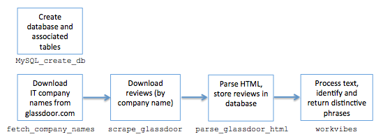

## WorkVibes

Summarize company reviews from Glassdoor.com.

The overall workflow is as follows:

### Components included in this repository:

MySQL_create_db.mysql:  Create database and associated tables.

fetch_company_names.py:  Acquire the names of approx. 40,000 U.S. Information Technology companies that have reviews posted on Glassdoor.com.

parse_glassdoor_html.py:  Parse html. For each review store the company, location, review text, and reviewer data into a MySQL database.

replacers.py, replacers.pyc:  Define and compile several text replacement patterns for review preprocessing.

scrape_glassdoor.py:  Download html pages with review text for bay area companies.

workvibes.py:  Preprocess and vectorize review text for a company, and then curate and return a user-specified number of distinctive phrases.
